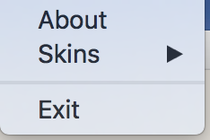
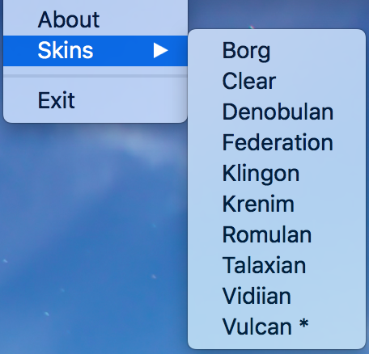
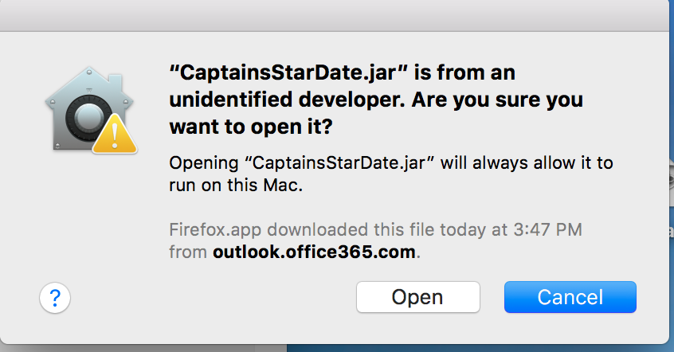

# Free Stardate Calculator Java App
A Free Stardate Calculator Java App : A Trek Themed TaskBar App 

## WHY?
Firstly, I will ask the question for you fine reader; why this application?
Well, I needed a way to mark down particular date/times with a positively increasing number that can mapped back to a particular event.
For instance: suppose with each code checkin we want to capture a unique identifier ... well, with the stardate widget I can capture a 
positively increasing number such as '71356.901' and I can now stamp whatever record with that number which represents the date/time : 'Tue Nov 21 19:36:00 PST 2017'

## What does the UI looks like ?
The widget sits in your task bar such as following UI examples:

### Windows: 

### Linux

### Mac 

### When you 'left' click the taskbar icon you'll get an option of:

#### Upon Selecting the 'Skins' selection, you'll get the full list of skins that are available:

From here, your choice of skin will be applied to the StarDate UI

### The StarDate UI
Hovering over the tray icon will show the stardate time plus the real time, one is also able to double click on the 
tray icon _**(double click in win/*nix - mac you need a mouse with the right/left button)**_ the themed StarDate UI comes to life such as:

While the 'StarDate UI' is visible, one can click into the value of the StarDate and change the value of the StarDate + hit enter to get the relevant 'real' date:

It is also possible to select the edit the real date by clicking on 'real' date/time and editing the date-string to whatever value you want to see the StarDate:

For example, we can enter the following dates and get back the StarDates:
* Wed May 31 07:45:14 PST 1999 : 52877.795
* Mon May 31 07:45:14 PST 1999 : 52877.795

This does imply a certain amount of spoof checking thanks to the Java Calendar library

### Locked or Not 
Each skin comes with a configurable button that allows a user to define where the button to set the application as always "visible" is placed.
In the example of the default Vulcan skin (my determined favourite I created), below are images of when the action to lock or not are set.
Each skin comes with it's own custom location for the button + a unique animation for that particular action!

#### Vulcan Unlocked Skin

#### Vulcan Locked Skin

## Custom Configuration
Check out the 'CaptainStarDateCalculator/src/conf/CaptainsStarDate.properties' file for a full view of all the skins published with this release and how to code **your** own skin. 

## So how do I run it ?
a. download this repository either by git or simply the 'Clone or download' button

b. you can either build the entire app from scratch with apache ant and run the build.xml to generate the current release or use the executables under CaptainStarDateCalculator/release_71351.052_jdk_1.8
to run the application.

i.   Under Windows: execute the run.bat

ii.  Under Linux: execute the run.sh through a terminal... or simply 'java -jar CaptainsStarDate.jar' from a terminal

iii. Under Mac: it's simple enough to double click the jar file, however you'll be presented with a security check saying the application publisher can't be authenticated, hence, you have to go to preference > privacy & security and enable the jar file to run:

Once you have accepted the 'Open Anyway' button, you'll lastly be present with the last warning:

Post hitting the 'Open' button you'll be able to run this app/jar anytime !

## Know Issues:

I.   Under Windows 7+, this app runs fine as this is 'development' environment I've mostly run and tested against... so basically it runs without problems.

II.  Under Linux, this app is less buggy, and pretty much works just as the windows environment with one or two minor issues I have encountered (all due to oddities with the awt related libraries)

III. Under Mac, this app is oddly buggy, that is, the right and left click's are some what confused with the overall system->jvm events. 
UI... it works, there are curious moving issues as well as raising and lowering the app from focus.... 
I solely blame Apple and their lack of JVM compliance as compared to the regular *x86 stream

## Credits:
As read from 'main'
* Initial algorithm to compute a 'StarDate' comes from the script © Phillip L. Sublett : http://TrekGuide.com
* Panels created for this application are loosely based off images from: http://www.lcars.org.uk/lcars_Alien_panels.htm

